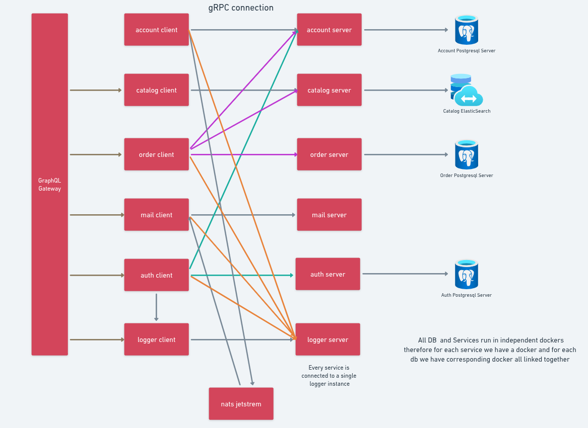
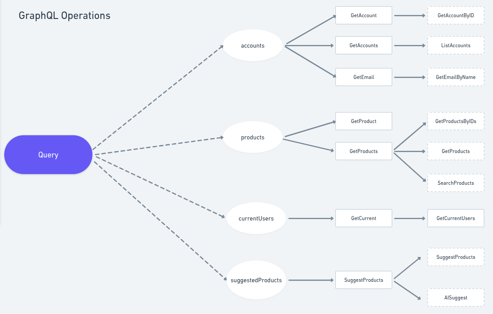
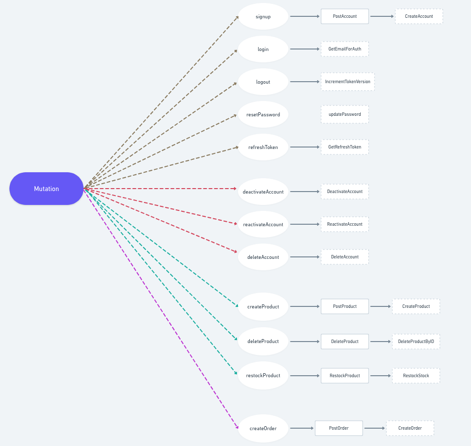
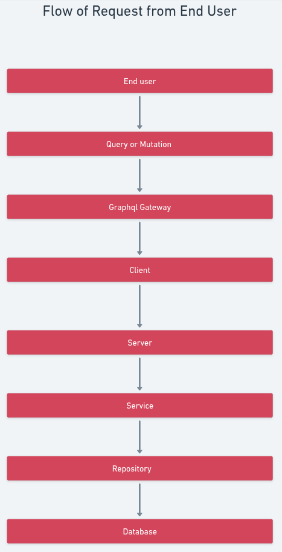
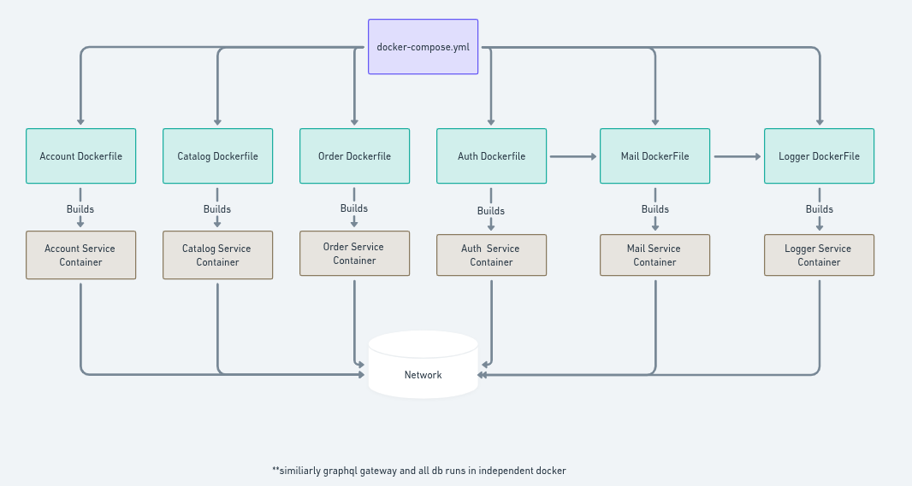

# 🚀 grpc-go-elastic-graphql-scalable-robust-microservice

**Scalable. Modular. Production-Ready Microservice Architecture built with Go, GraphQL, gRPC, NATS, Elasticsearch, and PostgreSQL**


---

## 🌞 Table of Contents

1. [☀️ Overview](#-overview)
2. [🔥 Features](#-features)
3. [🧱 Microservices](#-microservices)

   * [1. Account Service](#1-account-service)
   * [2. Auth Service](#2-auth-service)
   * [3. Catalog Service](#3-catalog-service)
   * [4. Order Service](#4-order-service)
   * [5. Logger Service](#5-logger-service)
   * [6. GraphQL Gateway](#6-graphql-gateway)
   * [7. Mail Service](#7-mail-service)
4. [📂 Project Structure](#-project-structure)
5. [🛠️ Tech Stack](#-tech-stack)
6. [🚀 Getting Started](#-getting-started)

   * [Prerequisites](#-prerequisites)
   * [Installation & Setup](#-installation--setup)
7. [🧱 System Architecture](#-system-architecture)

   * [gRPC Connection Flow](#grpc-connection-flow)
   * [GraphQL Query](#graphql-query)
   * [GraphQL Mutation](#graphql-mutation)
   * [Flow of Request from End User](#flow-of-request-from-end-user)
   * [Docker Compose Architecture](#docker-compose-architecture)
8. [🌐 API Documentation (GraphQL)](#-api-documentation-graphql)
9. [🤝 Contributing](#-contributing)
10. [👨‍💻 Author](#-author)

---

---

## 🌞 Overview

This project demonstrates a **robust microservice-based system** using Go, designed to be **modular, scalable, observable, and production-ready**. It leverages modern protocols like **GraphQL**, **gRPC**, and **event-driven architecture** using **NATS JetStream** for real-time communication and **Elasticsearch** for blazing-fast product search.

---

## 🔥 Features

`GraphQL Gateway with Resolver-Based Architecture`
Client-facing GraphQL layer that delegates all queries/mutations to internal services via gRPC. Includes pagination, validation, and centralized access point.

`gRPC-Based Communication Between Services`
All microservices interact using efficient gRPC, enabling type-safe contracts and faster communication compared to REST.

`gRPC Logging Interceptor`
Every gRPC call across services is automatically intercepted and logged, capturing metadata, errors, duration, and more.

`Centralized Logging Microservice (gRPC-Based)`
Custom gRPC logging service aggregates logs from all microservices into a single location for easier debugging and observability.

`Local Structured Logging with Zap`
Each service uses Uber’s `zap` logger for performant, structured local logs—configurable for development and production.

`Mail Microservice`
Standalone microservice for sending email notifications—can support OTP, signup emails, and alerts.

`Asynchronous Email Queuing with NATS`
Emails are queued via NATS JetStream, ensuring reliable delivery and decoupling from business logic.

`Template Rendering Engine`
Supports both HTML and plain-text email templates using Go’s template engine.

`JWT Authentication & Role-Based Authorization`
Secure token-based login flow with admin/user roles. Tokens include versioning support to invalidate on logout/reset.

`Token Versioning for Logout/Reset Invalidation`
Every JWT token includes a version field checked against DB to support real-time revocation without blacklists.

`NATS JetStream for Event-Driven Updates`
Product/order events (like stock update or order placed) are propagated across services asynchronously and reliably.

`Elasticsearch for Full-Text & Semantic Search`
Products are indexed and searchable via Elasticsearch; supports multi-field search and OpenAI embeddings.

`AI-Powered Semantic Search Ready`
Integrated with OpenAI embedding API for intelligent, semantic product suggestions.

`PostgreSQL for Relational Data Persistence`
Each microservice uses PostgreSQL with its own schema and indexes, optimized for transactional operations.

`Input Validation at GraphQL Entry Point`
All mutations and queries are validated at the gateway using Go Validator, improving performance and security.

`Dockerized Setup with Health Checks`
Every service runs in a Docker container with robust healthchecks to ensure availability and stability.

`Clean, Modular Architecture`
Clear separation of concerns across layers: GraphQL API, service logic, DB access, and infrastructure.

`Scalable & Extendable Microservices Design`
Each microservice is self-contained, testable, and designed to scale horizontally.

`Testing & Debugging Support`
Central logs, interceptors, and request validation make it easy to monitor and test the system behavior.


---

## 🧱 Microservices

| Service     | Responsibilities                                                              |
| ----------- | ----------------------------------------------------------------------------- |
| **account** | Manages user accounts: creation, retrieval, activation, deactivation          |
| **auth**    | Handles authentication: login, signup, JWT generation, logout, password reset |
| **catalog** | Manages product inventory and syncs data to Elasticsearch for fast search     |
| **order**   | Creates and retrieves orders tied to accounts and products                    |
| **logger**  | Aggregates logs from all services via gRPC and writes them to a central file  |
| **gateway** | GraphQL interface that routes all client queries/mutations to microservices   |
| **mail**    | Renders and sends transactional emails (HTML/text); consumes NATS queue        |

---

### 🔹 **1. Account Service**

**Purpose:** Stores and manages user accounts.
* Create new accounts (ID, Name, Email)
* Fetch account by ID or name
* Deactivate or reactivate users
* Used by `auth`, `order`, and `gateway`
* Pagination supported
* Validation enforced at GraphQL layer

---

### 🔹 **2. Auth Service**

**Purpose:** Provides secure authentication and session control.
* Signup & Login via email + password
* Issues JWT access & refresh tokens
* Supports token **versioning** for logout/reset revocation
* Role-based access: `admin`, `user`
* Password reset via email
* Uses account service to retrieve user data
* Token validation exposed via gRPC for other services

---

### 🔹 **3. Catalog Service**

**Purpose:** Manages product lifecycle and integrates with Elasticsearch.
* Add, delete, update products
* Restock product inventory
* Sync product data to Elasticsearch for:
  * Full-text search
  * Semantic AI-based suggestions (via OpenAI embeddings)
* Suggest endpoint for smart product suggestions


---

### 🔹 **4. Order Service**

**Purpose:** Manages customer orders, linking accounts and products.
* Create order by passing `accountID` and `productIDs`
* Calculates total price and updates product stock
* Fetch order by ID or by account
* Uses subscriptions to stimulate order status changes
* Relies on catalog service to validate product data

---

### 🔹 **5. Logger Service**

**Purpose:** Centralized logging system.
* Accepts structured logs from all services over gRPC
* Writes logs to a centralized file (e.g., `centralized.log`)
* Supports local logging fallback via Zap

---

### 🔹 **6. GraphQL Gateway**

**Purpose:** Acts as the single API gateway to the system.
* Accepts all GraphQL queries and mutations
* Uses resolvers to forward requests to respective gRPC services
* Input validation at schema boundary using Go Validator
* Handles pagination, role-based access, and timeout contexts
* Includes advanced queries:
  * Product suggestions (with optional AI)
  * Fetch current users (admins only)
* Supports GraphQL Playground for exploration

---

### 🔹 **7. Mail Service**

**Purpose:** Sends transactional emails.
* Asynchronous email delivery via NATS JetStream
* Renders both HTML and plain-text emails


---

## 🗂 Project Structure

```bash
building-scalable-microservices/
├── account/             # Account microservice
├── auth/                # Auth microservice 
├── catalog/             # Product microservice
├── order/               # Order microservice
├── logger/              # Logger microservice 
├── mail/                # Mail microservice 
├── gateway/             # GraphQL Gateway
├── embed/               # Python script for embedding generation
├── docker-compose.yml   # Complete multi-container setup
```

---

## 🛠 Tech Stack

* **Go** – Primary language for all microservices
* **gRPC** – Efficient inter-service communication using Protocol Buffers
* **GraphQL** – Gateway layer for client interaction and unified API access
* **PostgreSQL** – Persistent storage for accounts, products, and orders
* **NATS JetStream** – Message broker for async, event-driven communication (email queueing, event propagation)
* **Elasticsearch** – Storage for catalog with semantic full-text product search and popularity ranking suggestion 
* **OpenAI Embeddings** – AI-powered semantic search integration for product suggestions
* **Zap** – Structured, high-performance logging within services
* **Docker** – Containerized setup for all services
* **Docker Compose** – Orchestration and healthcheck configuration
* **Python** – For OpenAI embedding generation in embed microservice

---


## 🚀 Getting Started

### 🌟 Prerequisites

* Go 1.21+
* Docker + Docker Compose

### ⚙️ Installation & Setup

```bash
git clone https://github.com/zenvisjr/building-scalable-microservices.git
cd building-scalable-microservices
docker-compose up --build
```

Visit GraphQL playground at `http://localhost:8000/graphql`

---

To add and describe your 5 architecture diagrams in your `README.md`, follow this structure:

---

## 🧱 System Architecture

Below are visual diagrams to understand how different components of the `grpc-go-elastic-graphql-scalable-robust-microservice` work together.

---


### 🛰️ gRPC Connection Flow



**Explanation:**

* Each microservice has a gRPC client and server.
* GraphQL Gateway communicates with gRPC clients.
* Services connect to their respective DBs and also communicate with each other when needed.
* Logger is shared across all for centralized logging.
* NATS JetStream acts as the async message broker between services (e.g., order → mail, catalog updates).

---

### 📥 GraphQL Query



**Explanation:**

* Central `Query` block branches into GraphQL queries like `accounts`, `products`, `suggestedProducts`, etc.
* These query resolvers interact with their corresponding gRPC services and databases.

---
### 🔄 GraphQL Mutation



**Explanation:**

* The central `Mutation` block shows all GraphQL mutations supported by the system.
* Each mutation (circle) calls a resolver, which in turn calls gRPC services and DB operations.
* Rectangle nodes are the named services; dotted rectangles represent DB-level operations.

**📝 Note:**

* *Circle*: GraphQL mutation you call
* *Rectangle*: Service layer function
* *Dotted Rectangle*: DB operation (internal DB operations may exist but are not shown here)
* If a rectangle is missing, service and DB method name are the same

---

### 🔁 Flow of Request from End User



**Explanation:**

* Shows how a user request (query or mutation) flows through the system.
* Begins at the frontend → GraphQL Gateway → Client → Server → Service Layer → Repository → DB.
* Clean separation of concerns ensures modularity and debuggability.

---


### 🐳 Docker-Compose Architecture



**Explanation:**

* Each microservice (account, catalog, order, auth, mail, logger, GraphQL) and DB (PostgreSQL/Elastic) runs in its own container.
* Managed using a unified `docker-compose.yml` file.
* Ensures isolated environments and inter-service networking for clean deployment.

---


## 🌐 API Documentation (GraphQL)

### Account Mutations

```graphql
mutation {
  signup(input: {name: "Naruto", email: "ninja@leaf.com", password: "ramen123"}) {
    accessToken
    refreshToken
    userId
  }

  login(input: {email: "ninja@leaf.com", password: "ramen123"}) {
    accessToken
    userId
  }
}
```

### Product & Order

```graphql
mutation {
  createProduct(input: {name: "Kunai", description: "Steel weapon", price: 30.0, stock: 10}) {
    id
  }

  createOrder(input: {
    accountId: "xyz123",
    products: [{id: "prod123", quantity: 2}]
  }) {
    id
    totalPrice
    products {
      name
      price
    }
  }
}
```

### Queries

```graphql
query {
  products(query: "kunai") {
    name
    price
    stock
  }

  accounts(name: "Naruto") {
    id
    email
  }
}
```

## 🤝 Contributing

1. Fork the repo
2. Create your feature branch (`git checkout -b feature/awesome`)
3. Commit your changes (`git commit -am 'Add awesome feature'`)
4. Push to the branch (`git push origin feature/awesome`)
5. Create a Pull Request

---

💬 Need feature ideas? Add:

* OpenTelemetry support
* Circuit breakers (Hystrix-like)
* Distributed tracing
* Rate limiting middleware
* GraphQL Subscriptions

---

Here's your **👨‍💻 Author** section added in the same structured style:

---

## 👨‍💻 Author

**Ayush Rai**

📧 Email: [ayushrai.cse@gmail.com](mailto:ayushrai.cse@gmail.com)


---

